# Aplicación web de gestión de videojuegos
Aplicación web desarrollada con PHP para la gestión de un videoclub. Diseño de vistas por tipo de clientes (normales y administradores) y CRUD.

## INICIO
* Página de inicio con todos los productos disponibles en tienda (vista sesión no iniciada).

  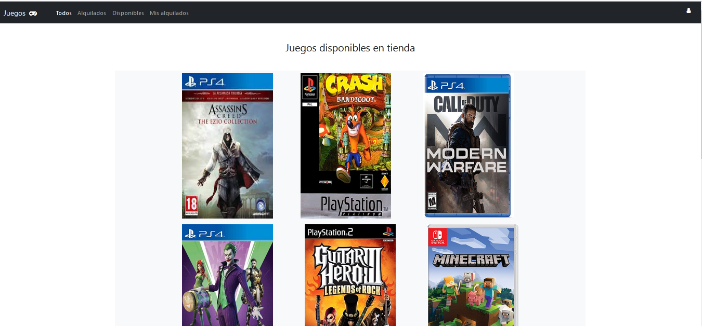

## LOG IN
* Log in para acceder como usuario registrado a la aplicación.

  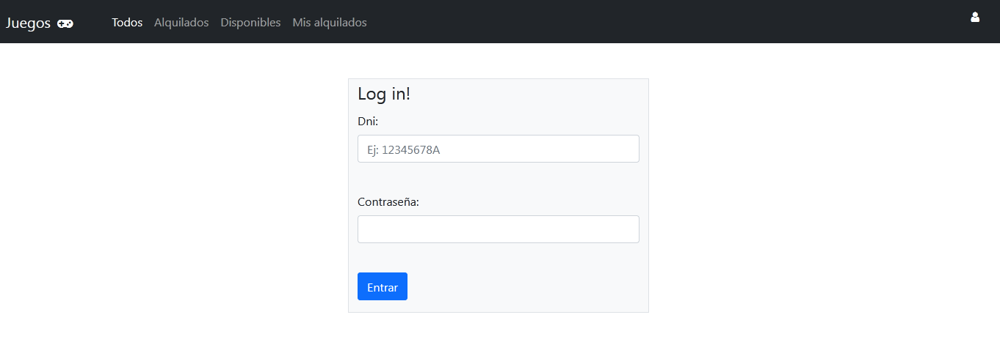

* Control de intentos de sesión.

  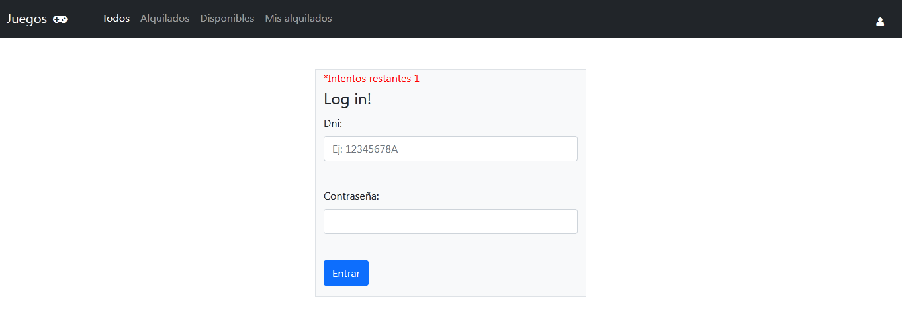

* Bloqueo de cuenta cuando se agotan los intentos.

  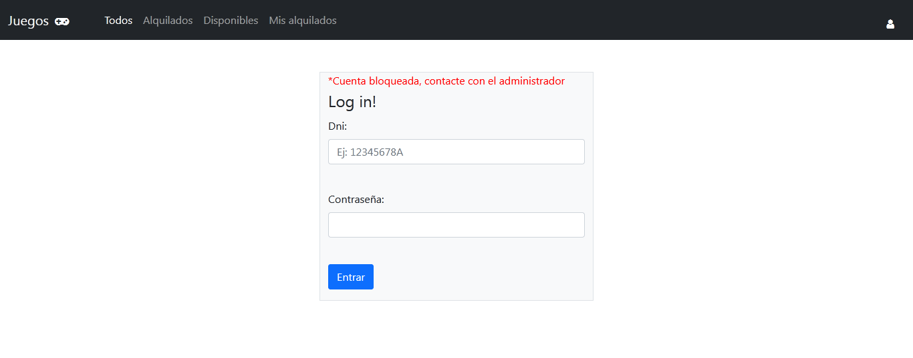

## INICIO LOGUEADO
* Página de inicio para usuario logueado, desde dónde se podrán ver los juegos disponibles para alquilar (los que actualmente se encuentran alquilados aparecen en escala de grises) y proceder a alquilarlos.

  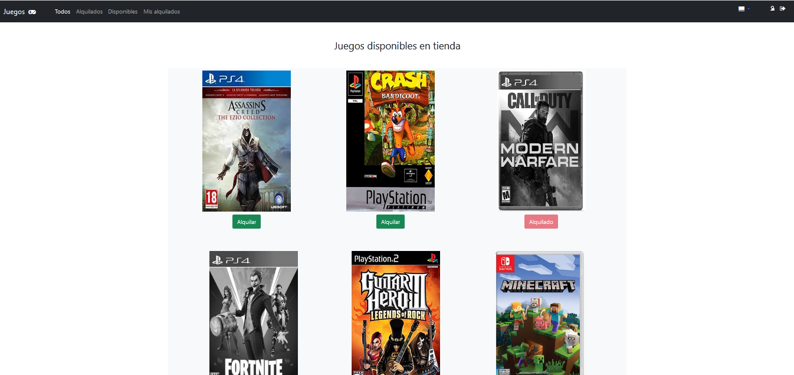

## DEVOLVER JUEGO
* Espacio para ver los juegos alquilados actualmente y proceder a su devolución.

  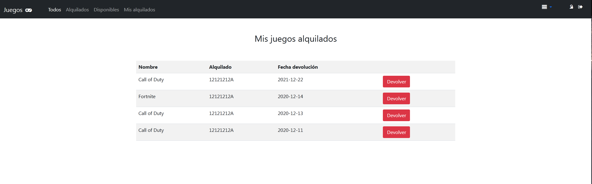

# VISTA ADMINISTRADOR
## DESBLOQUEO DE USUARIOS
* Si existen usuarios bloqueados, el administrador puede reactivar sus cuentas.

  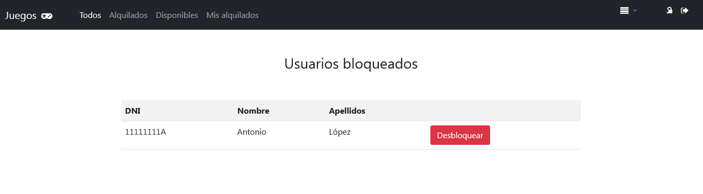

  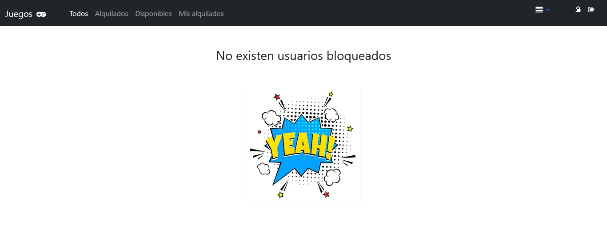

## CRUD

  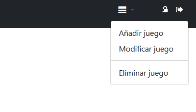

### AÑADIR JUEGOS A LA TIENDA
* Página con un formulario para dar de alta nuevos juegos en la tienda.

  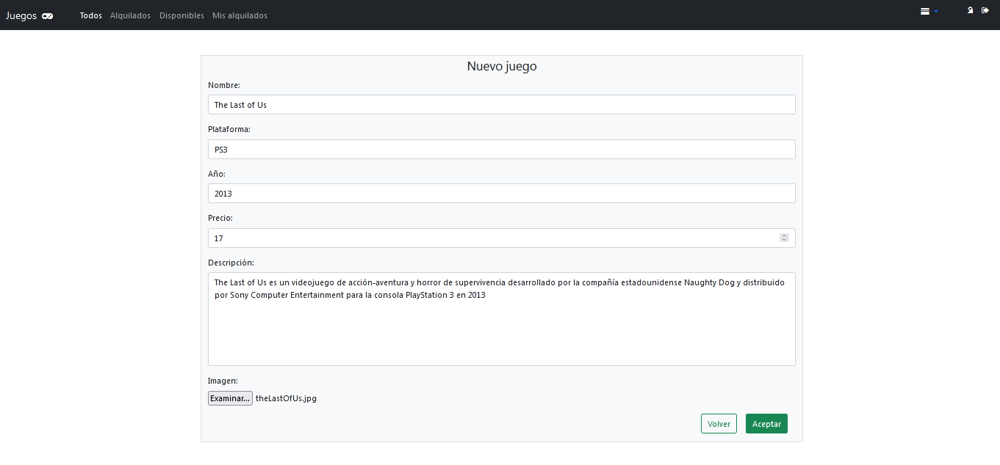

### MODIFICAR JUEGOS
* Espacio exclusivo del administrador para modificar los juegos existentes en tienda.

  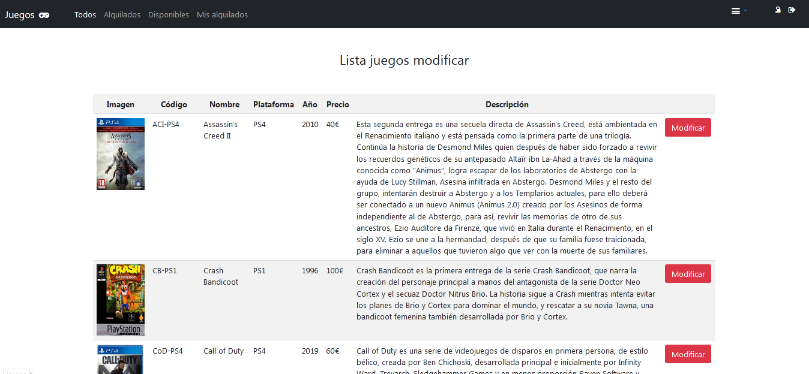

  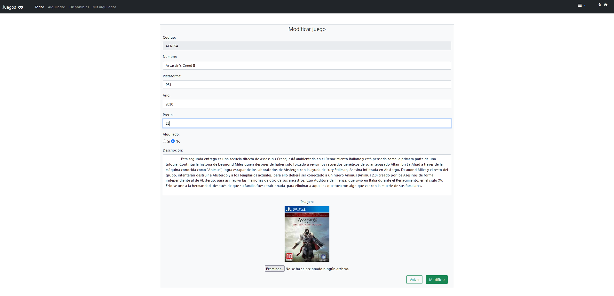

  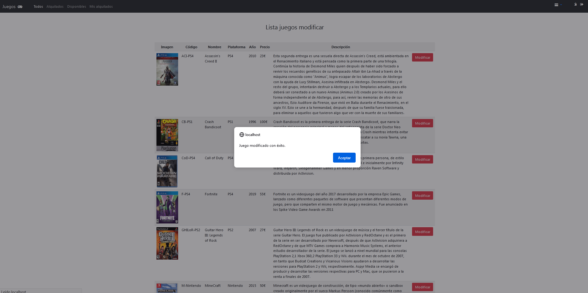

### ELIMINAR JUEGOS
* Página para dar de baja juegos en tienda.

  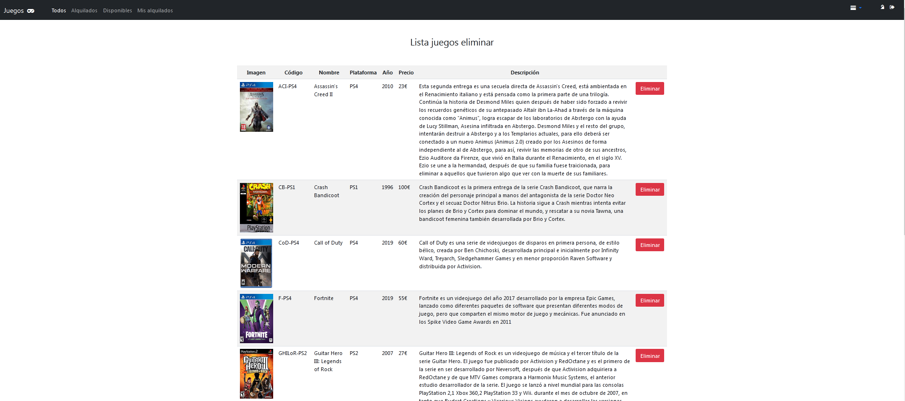

